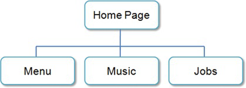
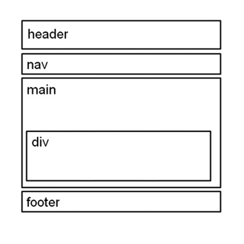

# WEBSITE CASE STUDY

## JavaJam Coffee House

Julio Perez is the owner of the JavaJam Coffee House, a gourmet coffee shop that serves snacks, coffee, tea, and soft drinks. Local folk music performances and poetry readings are held a few nights during the week. The customers of JavaJam are mainly college students and young professionals. Julio would like a web presence for his shop that will display his services and provide a calendar for the performances. He would like a:

- home page
- menu page
- music performance schedule page
- job opportunities page

## Site Map

## Wireframe

## Completed tasks:

1. Create a folder for the JavaJam website.
2. Create the Home page: index.html.
3. Create the Menu page: menu.html.
